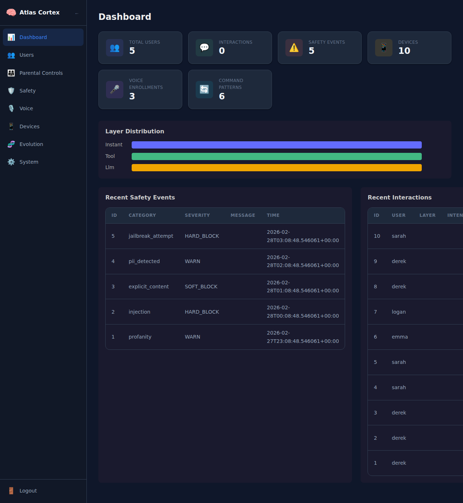

<div align="center">

# 🧠 Atlas Cortex

**A self-evolving AI assistant that learns, adapts, and grows with your household.**

[](https://www.python.org/downloads/)
[](LICENSE)
[](#testing)
[](https://github.com/open-webui/open-webui)

*Hardware-agnostic · Privacy-first · Family-safe · Self-learning*

</div>

---

Atlas Cortex transforms a local LLM into an intelligent home assistant that understands who's speaking, adapts to each family member, controls your smart home, and gets smarter every day — all running on **your hardware**, with **zero cloud dependencies**.

## ✨ Key Features

### 🚀 Intelligent Response Pipeline
| Layer | Latency | What Happens |
|-------|---------|--------------|
| **Context Assembly** | ~1ms | Identifies speaker, room, sentiment, time-of-day |
| **Instant Answers** | ~5ms | Date, time, math, greetings — no LLM needed |
| **Plugin Dispatch** | ~100ms | Smart home control, lists, knowledge search |
| **LLM Generation** | ~500–4000ms | Full reasoning with filler streaming for zero perceived wait |

### 🏠 Smart Home Integration
- **Natural language control** — *"Turn off the bedroom lights"* executes directly via Home Assistant API
- **Spatial awareness** — knows which room you're in via satellite mics and presence sensors
- **Scene automation** — *"Good night"* triggers your bedtime routine
- **Self-learning** — commands that go to the LLM are analyzed nightly and converted into fast regex patterns

### 🗣️ Voice & Speech Engine
- **Multi-TTS stack** — Qwen3-TTS (primary), Fish Audio S2 (story character voices), Orpheus (emotional), Kokoro (CPU), Piper (fast fallback)
- **Voice identification** — recognizes family members by voice, personalizes responses per person
- **TTS hot-swap** — swap voice models at runtime for character voices in stories
- **Sentence-boundary streaming** — starts speaking before the full response is generated
- **Speaker age estimation** — hybrid age detection for content tier assignment

### 🎭 Avatar System
- **Animated face** — Nick Jr. Face-inspired SVG avatar with real-time lip-sync and expressions
- **Audio-synced visemes** — mouth shapes timed to actual TTS audio duration, not guesswork
- **Content-aware expressions** — silly grin after joke punchlines, thinking face during processing
- **Pre-cached joke bank** — 25 kid-friendly jokes with instant TTS playback, weekly rotation
- **Interactive button** — `#show-joke-button` URL hash enables a "Tell me a joke" button on the display
- **WebSocket streaming** — TTS audio, visemes, and expressions all delivered in real-time


*Neutral · Talking · Silly grin (after a joke punchline)*

### ⏰ Alarms, Timers & Reminders
- **Natural language time parsing** — *"Wake me up at 7am"*, *"Set a 15-minute timer"*
- **Recurring alarms** with RRULE recurrence rules
- **Notification routing** — deliver to the right satellite speaker or HA media player
- **Snooze/dismiss via voice** — *"Snooze for 5 minutes"* / *"Stop"*

### 🔄 Routines & Automations
- **Built-in routines** — *"Good morning"* → lights, coffee, weather, calendar
- **Custom routines** — *"When I say 'movie time', dim lights and turn on TV"*
- **Multiple triggers** — voice command, cron schedule, HA events
- **Conversational builder** — Atlas asks clarifying questions to build routines
- **Templates** — pre-built routines for common scenarios

### 📡 Proactive Intelligence
- **Rule engine** with notification throttling
- **Weather, energy, anomaly, and calendar providers**
- **Daily briefing** — personalized morning summary
- **Pattern detection** — learns household habits over time

### 📚 Learning & Education
- **Socratic tutoring** — guides understanding, never gives direct answers
- **Quiz generator** — math curriculum through Calculus III
- **3 STEM games** — Number Quest, Science Safari, Word Wizard
- **Progress tracking** and parent reports per child

### 📢 Intercom & Broadcasting
- **Targeted announce** — *"Tell the kids dinner is ready"* → children's rooms
- **Whole-house broadcast** — all satellites simultaneously
- **Two-way calling** — *"Atlas, talk to the garage"*
- **Drop-in monitoring** — listen to a room without announcement
- **Zone groups** — broadcast to custom room groups

### 🎵 Media & Entertainment
- **YouTube Music, Plex, Audiobookshelf, Podcasts**
- **Local music library** with ID3 tag scanning
- **Multi-room playback** via satellite → Chromecast → HA media players
- **Playback router** — picks the best output for each room

### 📖 Story Time
- **Interactive branching stories** with user choices
- **Character voices** via Fish Audio S2 with TTS hot-swap
- **Story library** — save, resume, and replay stories
- **Age-appropriate content** per user profile

### 🤖 Self-Evolution
- **Conversation quality analysis** — identifies areas for improvement
- **LoRA training pipeline** on AMD GPUs (ROCm) — runs overnight
- **Model scout** with safety gates — finds and evaluates new models
- **A/B testing** for model comparisons
- **Personality drift monitoring** — ensures consistency over time

### 💻 Atlas CLI Agent
- **Interactive chat**: `atlas chat`
- **Autonomous agent**: `atlas agent "build an API"`
- **31 agent tools** — file, shell, git, web, vision, memory
- **ReAct reasoning loop** with context management and sessions

### 🌐 Standalone Web App
- **Browser chat** with WebSocket streaming
- **Voice input/output** in the browser
- **Animated avatar** with lip-sync
- **Unified dashboard** for all Atlas features

### 🛡️ Safety & Content Policy
- **Age-appropriate responses** — automatically adapts vocabulary and content for toddlers, children, teens, and adults
- **Educational mode** — uses scientific terminology for biology/anatomy at all ages — never evasive
- **5-layer jailbreak defense** — regex patterns, semantic analysis, system prompt hardening, output monitoring, adaptive learning
- **PII protection** — SSN, credit card, phone, email auto-redacted from logs and memory
- **Crisis detection** — recognizes self-harm/emergency language and responds with appropriate resources

### 🧠 Memory & Learning
- **HOT/COLD architecture** — ChromaDB vector search + SQLite FTS5 with reciprocal rank fusion
- **Persistent memory** — remembers conversations, preferences, and facts across sessions
- **Nightly evolution** — analyzes patterns, learns from mistakes, evolves personality profiles
- **Anti-hallucination** — confidence scoring, grounding loops, and mistake tracking

### 👤 User Profiles & Personality
- **Per-user adaptation** — vocabulary level, preferred tone, communication style
- **Honest personality** — pushes back on bad ideas, challenges in tutoring mode, never sycophantic
- **Emotional evolution** — builds unique rapport with each household member over time
- **Parental controls** — content filtering, allowed hours, restricted actions per child

### 🖥️ Admin Web Panel
- **Dark-themed dashboard** — real-time stats, recent activity, system health at a glance
- **20 views** — Chat, Dashboard, Users, UserDetail, Parental, Safety, Voice, Avatar, Devices, Satellites, SatelliteDetail, Plugins, Scheduling, Routines, Learning, Proactive, Media, Intercom, Evolution, Stories, System
- **User management** — profiles, age settings, vocabulary levels, parental controls
- **Safety monitoring** — guardrail event log, jailbreak pattern management, content tier overrides
- **Plugin management** — enable/disable 21 built-in plugins with per-plugin settings
- **Voice enrollment** — view and manage speaker profiles, confidence thresholds
- **Device management** — Home Assistant devices, aliases, command patterns
- **Evolution tracking** — rapport scores, emotional profiles, nightly evolution logs
- **System overview** — hardware info, GPU assignment, model configs, discovered services




> 📖 **[Full Admin Panel Guide →](docs/admin-guide.md)** — walkthrough with screenshots of every page

## 🏗️ Architecture

```
                        ┌───────────────────────┐
                        │    User Interface      │
                        │  Open WebUI / Voice    │
                        │  / Satellite Mics      │
                        └───────────┬───────────┘
                                    │
                        ┌───────────▼───────────┐
                        │    Atlas Cortex        │
                        │    Server (:5100)      │
                        │  OpenAI-compatible     │
                        └───────────┬───────────┘
                                    │
            ┌───────────────────────┼───────────────────────┐
            │                       │                       │
  ┌─────────▼──────────┐ ┌─────────▼──────────┐ ┌─────────▼──────────┐
  │   Input Pipeline    │ │  Safety Guardrails  │ │   Voice Engine      │
  │                     │ │                     │ │                     │
  │ L0: Context  (1ms)  │ │ • Content tiers     │ │ • Qwen3-TTS         │
  │ L1: Instant  (5ms)  │ │ • Jailbreak defense │ │ • Fish Audio S2      │
  │ L2: Plugins (100ms) │ │ • PII redaction     │ │ • Orpheus / Kokoro   │
  │ L3: LLM   (500ms+)  │ │ • Crisis detection  │ │ • Piper fallback     │
  └─────────┬──────────┘ └─────────────────────┘ └─────────────────────┘
            │
  ┌─────────▼───────────────────────────────────────────────────────┐
  │                         Integrations                           │
  │                                                                │
  │  🏠 Home Assistant  📋 Lists  📚 Knowledge  🔍 Memory        │
  │  🔧 Discovery  📦 Backup  🎓 Learning  ⏰ Scheduling         │
  │  🔄 Routines  📡 Proactive  📢 Intercom  🎵 Media            │
  │  📖 Stories  🤖 Evolution  💻 CLI Agent  🌐 Web App           │
  └───────────────────────────┬───────────────────────────────────┘
                                │
                     ┌──────────▼───────────┐
                     │  SQLite + ChromaDB    │
                     │  (WAL mode, 50+ tbl)  │
                     └──────────┬───────────┘
                                │
                     ┌──────────▼───────────┐
                     │  Nightly Evolution    │
                     │  LoRA training        │
                     │  Model scouting       │
                     │  Pattern learning     │
                     │  Profile evolution    │
                     │  Device discovery     │
                     └──────────────────────┘
```

### Multi-GPU Support

Atlas detects all GPUs at startup and assigns optimal roles:

```
┌─────────────────┐     ┌─────────────────┐     ┌─────────────────┐
│  GPU 0 (Largest)│     │  GPU 1 (Second) │     │  iGPU (Fallback)│
│  ═══════════════│     │  ═══════════════│     │  ═══════════════│
│  LLM Inference  │     │  Voice / TTS    │     │  Lightweight    │
│  Transformers   │     │  Qwen3-TTS      │     │  tasks only     │
│  20GB+ VRAM     │     │  8-12GB VRAM    │     │                 │
└─────────────────┘     └─────────────────┘     └─────────────────┘
```

- **Supported GPUs**: AMD (ROCm), NVIDIA (CUDA), Intel (oneAPI/IPEX), Apple (Metal)
- **Auto-sizing**: Models selected based on available VRAM — from 1.7B (4GB) to 72B (48GB+)
- **Mixed vendors**: Run AMD + Intel GPUs in the same system via separate containers

## 🚀 Getting Started

### Prerequisites

- **Python 3.11+**
- **[HuggingFace Transformers](https://huggingface.co/docs/transformers/)** — models download automatically on first use
- **[Open WebUI](https://github.com/open-webui/open-webui) v0.8.5+** (recommended) or any OpenAI-compatible client

> **Note:** [Ollama](https://ollama.com) is still supported as a legacy fallback — set `LLM_PROVIDER=ollama` to use it.

### Quick Start (Docker)

```bash
# Clone the repository
git clone https://github.com/Betanu701/atlas-cortex.git
cd atlas-cortex

# Start with Docker Compose (includes Qwen3-TTS, Whisper, Kokoro, Piper, and more)
# HuggingFace models download automatically via cached volume
docker compose -f docker/docker-compose.yml up -d

# For NVIDIA GPU support:
docker compose -f docker/docker-compose.yml -f docker/docker-compose.gpu-nvidia.yml up -d

# Atlas is now running at http://localhost:5100
# Chat UI: http://localhost:5100/chat
# Admin panel: http://localhost:5100/admin/
```

### Quick Start (Manual)

```bash
# Clone and set up
git clone https://github.com/Betanu701/atlas-cortex.git
cd atlas-cortex

# Create virtual environment
python3 -m venv .venv
source .venv/bin/activate

# Install dependencies (includes transformers, accelerate, sentence-transformers)
pip install -r requirements.txt

# Run the interactive installer
python -m cortex.install

# Or start the server directly (HuggingFace models download on first use)
CAG_MODEL=Qwen/Qwen3-4B EMBED_MODEL=all-MiniLM-L6-v2 python -m cortex.server
```

### Connect to Open WebUI

1. Open your Open WebUI instance
2. Go to **Admin → Settings → Connections**
3. Add a new OpenAI-compatible connection:
   - **URL**: `http://<atlas-host>:5100/v1`
   - **Model**: `atlas-cortex`
4. Start chatting — Atlas handles the rest

### Admin Panel Setup

The admin panel is a Vue 3 SPA served directly from the Atlas Cortex server.

```bash
# Build the admin panel (requires Node.js 18+)
cd admin
npm install
npx vite build
cd ..

# Start the server (admin panel is now available)
python -m cortex.server
```

Open **`http://localhost:5100/admin/`** in your browser.

| | |
|---|---|
| **Default username** | `admin` |
| **Default password** | `atlas-admin` |

> ⚠️ **Change the default password immediately** via the admin panel.
>
> 📖 **[Full Admin Panel Guide →](docs/admin-guide.md)** — walkthrough of every page with screenshots
>
> 📖 **[API Reference (144+ endpoints) →](docs/api-reference.md)** — complete endpoint documentation

### Discover Your Services

```bash
# Scan your network for Home Assistant, Nextcloud, MQTT, etc.
python -m cortex.discover
```

Atlas finds available services on your network and configures integrations automatically.

## ⚙️ Configuration

### Environment Variables

| Variable | Default | Description |
|----------|---------|-------------|
| `CORTEX_HOST` | `0.0.0.0` | Server bind address |
| `CORTEX_PORT` | `5100` | Server port |
| `CORTEX_DATA_DIR` | `./data` | Database and state directory |
| `LLM_PROVIDER` | `transformers` | LLM backend (`transformers`, `ollama`, `openai_compatible`) |
| `CAG_MODEL` | `Qwen/Qwen3-4B` | HuggingFace model for inference (Transformers provider) |
| `CAG_DEVICE` | `auto` | Device for model inference (`auto`, `cuda`, `cpu`) |
| `CAG_DTYPE` | `auto` | Model dtype (`auto`, `float16`, `bfloat16`) |
| `EMBED_MODEL` | `all-MiniLM-L6-v2` | Sentence-transformers embedding model |
| `OLLAMA_BASE_URL` | `http://localhost:11434` | Ollama API URL (legacy fallback) |
| `OPENAI_BASE_URL` | — | Custom OpenAI-compatible endpoint |
| `OPENAI_API_KEY` | — | API key for OpenAI-compatible backends |
| `MODEL_FAST` | `qwen2.5:14b` | Model for quick factual answers (Ollama/OpenAI providers) |
| `MODEL_THINKING` | `qwen3:30b-a3b` | Model for complex reasoning (Ollama/OpenAI providers) |
| `HA_URL` | — | Home Assistant URL (e.g., `http://192.168.1.100:8123`) |
| `HA_TOKEN` | — | Home Assistant long-lived access token |
| `CORTEX_JWT_SECRET` | `atlas-cortex-change-me` | Secret key for admin JWT tokens (change in production!) |
| `CORTEX_JWT_EXPIRY` | `86400` | Admin session duration in seconds (default: 24 hours) |

## 📡 API Reference

Atlas exposes an **OpenAI-compatible API** so any client that works with OpenAI/Ollama works with Atlas.

### Chat Completions

```bash
# Streaming
curl http://localhost:5100/v1/chat/completions \
  -H "Content-Type: application/json" \
  -d '{
    "model": "atlas-cortex",
    "messages": [{"role": "user", "content": "Turn off the living room lights"}],
    "stream": true
  }'
```

### Text-to-Speech

```bash
# Generate speech with emotion
curl http://localhost:5100/v1/audio/speech \
  -H "Content-Type: application/json" \
  -d '{
    "model": "kokoro",
    "input": "Good morning! The weather looks beautiful today.",
    "voice": "af_bella"
  }' --output speech.wav

# List available voices
curl http://localhost:5100/v1/audio/voices
```

### Health Check

```bash
curl http://localhost:5100/health
```

### Admin API

All admin endpoints require a JWT token. Quick example:

```bash
# Login and get token
TOKEN=$(curl -s http://localhost:5100/admin/auth/login \
  -H "Content-Type: application/json" \
  -d '{"username": "admin", "password": "atlas-admin"}' | python3 -c "import sys,json; print(json.load(sys.stdin)['token'])")

# Use with any admin endpoint
curl http://localhost:5100/admin/dashboard \
  -H "Authorization: Bearer $TOKEN"
```

> 📖 **[Full endpoint list (144+ endpoints) →](docs/api-reference.md)**

## 📁 Project Structure

```
atlas-cortex/
├── admin/                         # Vue 3 Admin Panel (SPA, 20 views)
│   ├── src/
│   │   ├── views/                 #   20 admin views (dashboard, users, safety, etc.)
│   │   ├── components/            #   Reusable components (NavBar, DataTable, etc.)
│   │   ├── router/                #   Vue Router with auth guards
│   │   ├── stores/                #   Pinia auth store
│   │   └── api.js                 #   API client with JWT handling
│   ├── package.json
│   └── vite.config.js
├── cortex/                        # Core Python package
│   ├── server.py                  # OpenAI-compatible FastAPI server
│   ├── auth.py                    # JWT authentication (bcrypt + PyJWT)
│   ├── pipe.py                    # Open WebUI Pipe function
│   ├── db.py                      # SQLite schema (50+ tables, WAL mode)
│   ├── admin/                     # Admin API domain routers (9 sub-routers)
│   ├── pipeline/                  # 4-layer processing pipeline
│   │   ├── layer0_context.py      #   Context assembly, sentiment, spatial
│   │   ├── layer1_instant.py      #   Instant answers (math, date, identity)
│   │   ├── layer2_plugins.py      #   Plugin dispatch (21 built-in plugins)
│   │   └── layer3_llm.py          #   Filler streaming + LLM generation
│   ├── providers/                 # LLM backend abstraction
│   │   ├── transformers.py        #   HuggingFace Transformers provider (default)
│   │   ├── ollama.py              #   Ollama provider (legacy fallback)
│   │   └── openai_compat.py       #   Any OpenAI-compatible backend
│   ├── speech/                    # All audio synthesis/transcription
│   │   ├── tts.py                 #   Multi-provider TTS with hot-swap
│   │   ├── stt.py                 #   Whisper + Wyoming STT
│   │   ├── voices.py              #   Voice resolution (satellite→user→system)
│   │   ├── cache.py               #   Unified audio cache
│   │   ├── fish_audio.py          #   Fish Audio S2 character voices
│   │   └── hotswap.py             #   Runtime TTS model swapping
│   ├── orchestrator/              # Request coordination (STT→pipeline→TTS)
│   ├── voice/                     # Legacy voice module (→ cortex.speech)
│   ├── safety/                    # Safety guardrails + jailbreak defense
│   ├── plugins/                   # Plugin framework (CortexPlugin, registry)
│   ├── integrations/              # HA, knowledge, lists, learning
│   ├── memory/                    # HOT/COLD memory (BM25 + vector, RRF)
│   ├── profiles/                  # User profiles & parental controls
│   ├── context/                   # Context window management
│   ├── avatar/                    # SVG avatar, lip-sync, expressions
│   ├── filler/                    # Sentiment-aware filler streaming
│   ├── grounding/                 # Anti-hallucination engine
│   ├── backup/                    # Automated backup/restore + offsite
│   ├── scheduling/                # Alarms, timers, reminders (NL time parsing)
│   ├── routines/                  # Routine automations, triggers, templates
│   ├── proactive/                 # Proactive intelligence, daily briefing
│   ├── learning/                  # Self-learning (fallthrough analysis)
│   ├── intercom/                  # Announce, broadcast, two-way calling
│   ├── media/                     # YouTube Music, Plex, ABS, podcasts
│   ├── stories/                   # Story generator, character voices
│   ├── evolution/                 # LoRA training, model scout, drift
│   ├── cli/                       # Atlas CLI agent (REPL, 31 tools)
│   ├── notifications/             # Alert and notification routing
│   ├── selfmod/                   # Self-evolution security gates
│   ├── content/                   # Pre-cached content (jokes)
│   ├── scheduler/                 # Background task management
│   ├── satellite/                 # Satellite WebSocket + provisioning
│   ├── install/                   # Hardware detection & installer
│   ├── discovery/                 # Network service discovery
│   └── integrity/                 # Data integrity checks
├── satellite/                     # Satellite agent (Pi, ESP32)
├── docker/                        # Docker deployment configs
├── docs/                          # Architecture, roadmap, guides (35+ files)
├── mocks/                         # GPU-free development servers
├── seeds/                         # Initial data (command patterns)
├── tests/                         # 3,660+ tests
├── requirements.txt
└── pytest.ini
```

## 🧪 Testing

```bash
# Run all tests
source .venv/bin/activate
python -m pytest tests/ -q

# Run specific module
python -m pytest tests/test_pipeline.py -v
python -m pytest tests/test_safety.py -v
python -m pytest tests/test_voice.py -v
```

**Current status: 3,660+ tests passing** across pipeline, providers, safety, voice, discovery, integrations, filler, memory, learning, evolution, avatar, admin, spatial, Wyoming, WebDAV, CalDAV, backup, multi-room, scheduling, routines, proactive, intercom, media, stories, CLI, and web app modules.

## 📊 Implementation Status

### Part 1: Core Engine

| Phase | Module | Status | Description |
|-------|--------|--------|-------------|
| C0 | Installer & Backend | ✅ Complete | LLM provider abstraction, GPU detection, CLI installer |
| C1 | Core Pipeline | ✅ Complete | 4-layer pipeline, sentiment, instant answers, filler streaming |
| C3a | Voice Identity | ✅ Complete | Speaker recognition, enrollment, hybrid age estimation |
| C4 | Emotional Evolution | ✅ Complete | Rapport tracking, personality drift, proactive suggestions |
| C5 | Memory System | ✅ Complete | HOT/COLD paths, vector search, BM25, RRF fusion |
| C6 | User Profiles | ✅ Complete | Age-awareness, onboarding, parental controls |
| C7 | Avatar System | ✅ Complete | SVG face, lip-sync visemes, emotion expressions, joke bank, TTS caching |
| C9 | Backup & Restore | ✅ Complete | Automated nightly backups, one-command restore |
| C10 | Context Management | ✅ Complete | Context windows, compaction, overflow recovery |
| C11 | Voice & Speech | ✅ Complete | Multi-TTS (Qwen3-TTS, Fish Audio S2, Orpheus, Kokoro, Piper), hot-swap, streaming |
| C12 | Safety Guardrails | ✅ Complete | Content tiers, jailbreak defense, PII redaction |
| — | Admin Web Panel | ✅ Complete | Vue 3 dashboard (20 views), JWT auth, 30+ REST endpoints |

### Part 2: Integration Layer

| Phase | Module | Status | Description |
|-------|--------|--------|-------------|
| I1 | Service Discovery | ✅ Complete | HTTP-probe scanner, service registry, config wizard |
| I2 | Home Assistant | ✅ Complete | REST + WebSocket client, device bootstrap, patterns |
| I3 | Voice Pipeline | ✅ Complete | Wyoming STT/TTS, spatial awareness, multi-room commands |
| I4 | Self-Learning | ✅ Complete | Fallthrough analysis, pattern lifecycle, nightly evolution |
| I5 | Knowledge Sources | ✅ Complete | WebDAV/Nextcloud, CalDAV calendars, sync scheduler |
| I6 | List Management | ✅ Complete | Multi-backend lists, HA to-do discovery, permissions |
| I7 | Offsite Backup | ✅ Complete | NAS rsync/SMB, voice commands, retention policy |

### Part 2.5–2.7: Satellite & Plugins

| Phase | Module | Status | Description |
|-------|--------|--------|-------------|
| S2.5 | Satellite System | ⏸️ Wake word deferred | Distributed speakers/mics, Pi + ESP32, provisioning |
| P2.7 | Fast-Path Plugins | ✅ Complete | 21 built-in plugins (weather, dictionary, wikipedia, conversions, movie, cooking, news, translation, stocks, sports, sound library, scheduling, routines, daily briefing, STEM games, stories, intercom, media + core 3) |

### Parts 3–12: Extended Features

| Phase | Module | Status | Description |
|-------|--------|--------|-------------|
| P3 | Alarms, Timers & Reminders | ✅ Complete | NL time parser, RRULE recurrence, notification routing |
| P4 | Routines & Automations | ✅ Complete | Voice/cron/HA triggers, templates, conversational builder |
| P5 | Proactive Intelligence | ✅ Complete | Rule engine, throttle, weather/energy/anomaly/calendar providers, daily briefing |
| P6 | Learning & Education | ✅ Complete | Socratic tutoring, quiz gen (through Calc III), 3 STEM games, progress tracking |
| P7 | Intercom & Broadcasting | ✅ Complete | Announce, broadcast, zones, two-way calling, drop-in monitoring |
| P8 | Media & Entertainment | ✅ Complete | YouTube Music, Plex, Audiobookshelf, podcasts, local library, playback router |
| P9 | Self-Evolution | ✅ Complete | Conversation analysis, LoRA training (ROCm/AMD), model scout, A/B testing, drift monitor |
| P10 | Story Time | ✅ Complete | Generator, character voices (Fish Audio S2), TTS hot-swap, interactive stories, library |
| P11 | Atlas CLI Agent | ✅ Complete | REPL, 31 agent tools, ReAct loop, context management, sessions |
| P12 | Standalone Web App | ✅ Complete | Browser chat, WebSocket streaming, voice I/O, avatar, unified dashboard |

### Coming Next

| Part | Name | Description |
|------|------|-------------|
| 13 | **Legacy Protocol** | Backward compatibility for older integrations |
| 14 | **Household Management** | Pet care, cooking assistant, inventory, chore tracking |
| 15 | **Security & Monitoring** | Camera summaries, motion alerts, visitor history |
| 16 | **Health & Wellness** | Medication reminders, sleep analysis, air quality |
| 17 | **Multi-Language Support** | Real-time language detection, per-user preferences |
| 18 | **Visual Media & Casting** | Screen casting, photo display, visual content |

> 📋 **Full roadmap with detailed plans:** [docs/roadmap.md](docs/roadmap.md)

## 📖 Documentation

Comprehensive design documentation lives in the [`docs/`](docs/) directory:

| Document | Description |
|----------|-------------|
| [Quick Start](docs/quickstart.md) | 5-minute setup guide (Docker, bare metal, satellite) |
| [Configuration](docs/configuration.md) | All environment variables and settings |
| [Architecture](docs/architecture.md) | System design, pipeline layers, evolution engine |
| [Data Model](docs/data-model.md) | 50+ SQLite tables, normalized schema, relationships |
| [Voice Engine](docs/voice-engine.md) | TTS providers, emotion composition, streaming |
| [Safety Guardrails](docs/safety-guardrails.md) | Content tiers, jailbreak defense, crisis protocol |
| [Context Management](docs/context-management.md) | Context windows, compaction, multi-GPU detection |
| [Memory System](docs/memory-system.md) | HOT/COLD architecture, vector search, RRF fusion |
| [User Profiles](docs/user-profiles.md) | Age-awareness, onboarding, parental controls |
| [Personality](docs/personality.md) | Honesty system, pushback, tutoring mode |
| [Grounding](docs/grounding.md) | Anti-hallucination, confidence scoring |
| [Knowledge Access](docs/knowledge-access.md) | Document indexing, privacy gates |
| [Lists](docs/lists.md) | Multi-backend lists, permissions |
| [Avatar System](docs/avatar-system.md) | Lip-sync, visemes, emotion expressions |
| [Backup & Restore](docs/backup-restore.md) | Automated backups, one-command restore |
| [Admin Panel Guide](docs/admin-guide.md) | Full walkthrough with screenshots |
| [API Reference](docs/api-reference.md) | All 144+ API endpoints |
| [Plugin Guide](docs/plugins-guide.md) | Plugin system for admins and developers |
| [Persistent Storage](docs/persistent-storage.md) | Docker volumes and data paths |
| [Satellite System](docs/satellite-system.md) | Satellite speaker/mic architecture |
| [Alarms & Timers](docs/alarms-timers-reminders.md) | NL time parsing, recurrence, notification routing |
| [Routines](docs/routines-automations.md) | Triggers, templates, conversational builder |
| [Proactive Intelligence](docs/proactive-intelligence.md) | Rule engine, providers, daily briefing |
| [Learning & Education](docs/learning-education.md) | Tutoring, quizzes, STEM games |
| [Intercom](docs/intercom-broadcasting.md) | Announce, broadcast, two-way calling |
| [Media](docs/media-entertainment.md) | YouTube Music, Plex, Audiobookshelf, podcasts |
| [Roadmap](docs/roadmap.md) | Future features and implementation plan |
| [Phases](docs/phases.md) | Implementation roadmap and dependency graph |
| [Installation](docs/installation.md) | Installer flow, backend abstraction |

## 🤝 Contributing

Atlas Cortex is open source and welcomes contributions!

1. **Fork** the repository
2. **Create a feature branch**: `git checkout -b feature/my-feature`
3. **Make your changes** and add tests
4. **Run the test suite**: `python -m pytest tests/ -q`
5. **Submit a Pull Request**

### Development Setup

```bash
git clone https://github.com/Betanu701/atlas-cortex.git
cd atlas-cortex
python3 -m venv .venv
source .venv/bin/activate
pip install -r requirements.txt
python -m pytest tests/ -q  # verify everything works
```

## 📄 License

[MIT](LICENSE) — use it, modify it, build on it.
