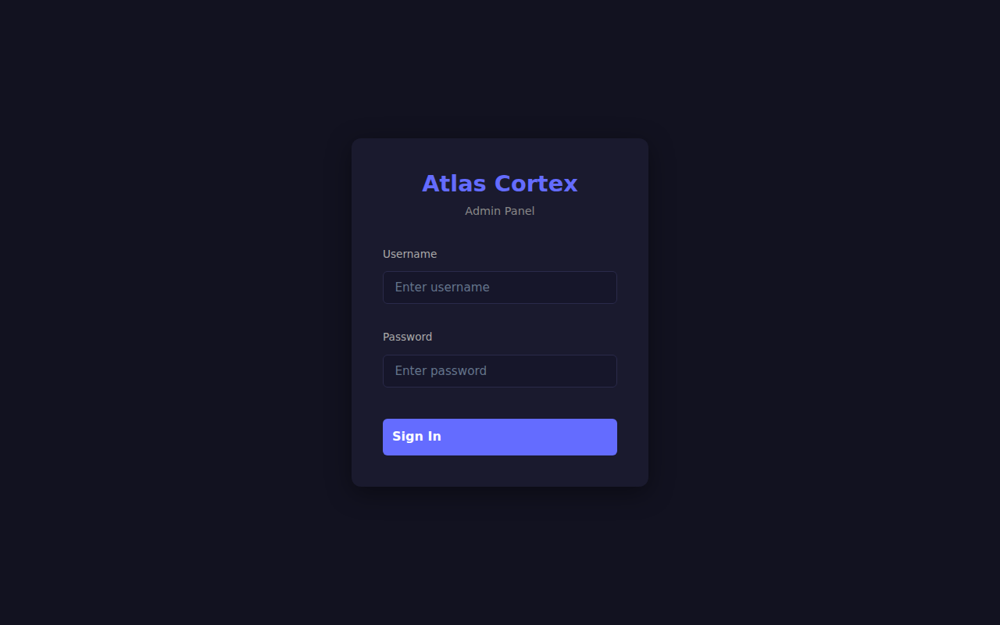
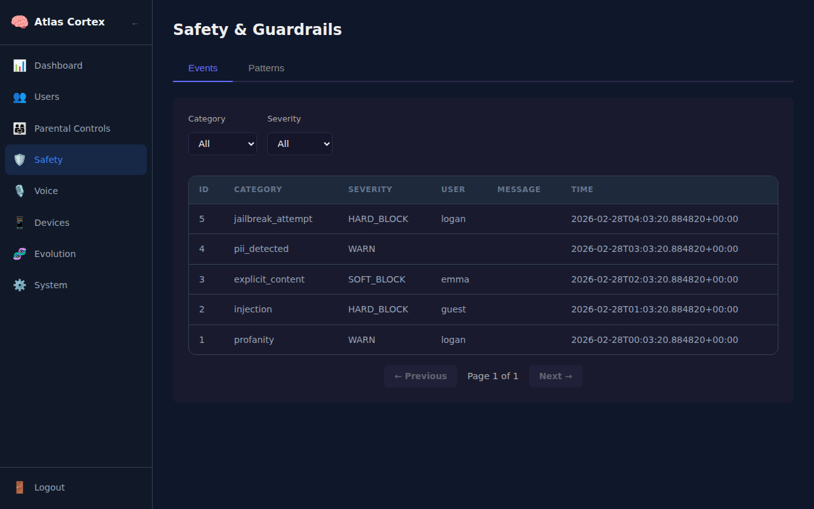
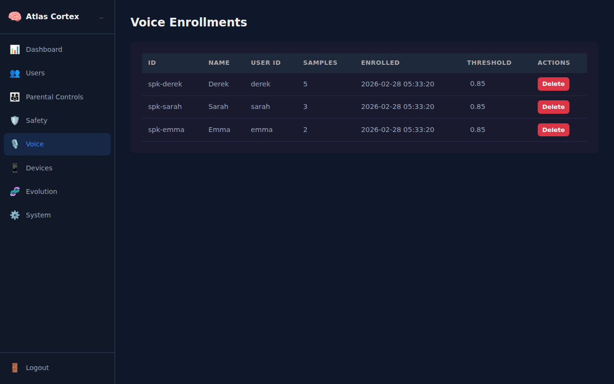
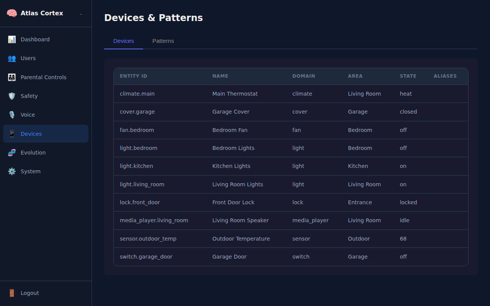
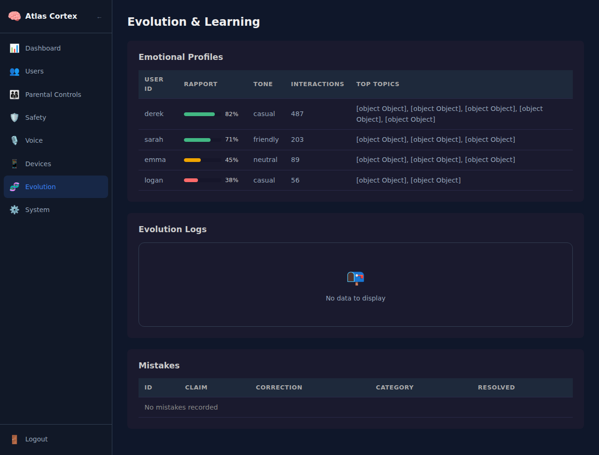
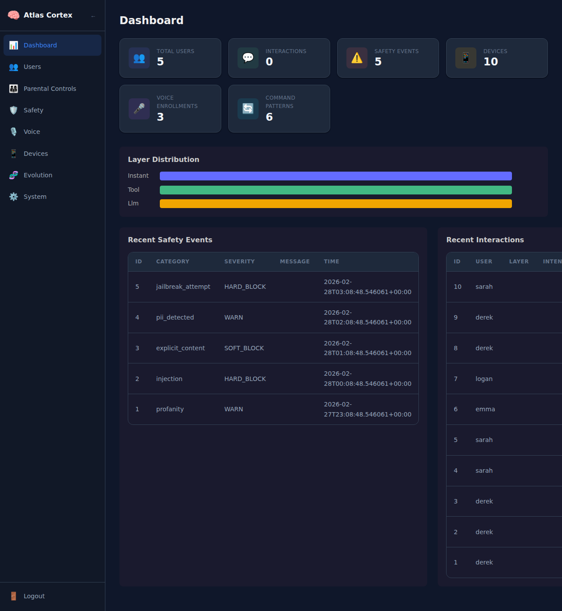

# 🖥️ Admin Panel Guide

> **Full walkthrough for the Atlas Cortex admin web panel.**

The admin panel is a dark-themed Vue 3 SPA that gives you full control over Atlas Cortex — user profiles, safety guardrails, voice enrollment, device management, and system monitoring.

---

## Getting Started

### 1. Build the Admin Panel

```bash
# Requires Node.js 18+
cd admin
npm install
npx vite build
cd ..
```

### 2. Start Atlas Cortex

```bash
python -m cortex.server
```

### 3. Open the Admin Panel

Navigate to **`http://localhost:5100/admin/`** in your browser.

| | |
|---|---|
| **Default username** | `admin` |
| **Default password** | `atlas-admin` |

> ⚠️ **Change the default password immediately** after first login.



---

## Dashboard

After logging in, you land on the **Dashboard** — your at-a-glance overview of the entire system.


**What you see:**
- **Stats cards** — total users, interaction count, safety events, device count
- **Layer distribution** — breakdown of how queries are handled (instant / tool / LLM)
- **Recent safety events** — latest guardrail triggers with severity and action taken
- **Recent interactions** — latest user queries with layer, intent, and response time

The dashboard updates each time you visit. Use it to spot trends — if LLM usage is high, you may need more command patterns. If safety events spike, check the Safety page for details.

---

## Users

Manage every household member's profile and preferences.


**Capabilities:**
- **View all users** — name, age group, vocabulary level, interaction count
- **Edit profiles** — click a user row to open their detail page
- **Set age** — birth year and month for accurate age-group classification
- **Vocabulary level** — `simple`, `moderate`, or `advanced` — controls response complexity
- **Preferred tone** — `casual`, `friendly`, `neutral`, `formal`
- **Communication style** — `brief`, `moderate`, or `detailed`
- **Delete users** — removes profile and all associated data

**Tip:** Age settings drive content filtering automatically. Setting a user's birth year to 2018 (age 8) automatically applies child-appropriate responses without needing separate parental controls.

---

## Parental Controls

Set content boundaries for children and teens.

**Capabilities:**
- **Content filter level** — `strict` (child), `moderate` (teen), or `permissive` (adult)
- **Allowed hours** — set start/end times when the child can interact with Atlas
- **Restricted topics** — block specific subjects (e.g., violence, social media)
- **Parent assignment** — link a child to a parent account for oversight

**How it works:** When a child interacts with Atlas outside allowed hours or asks about a restricted topic, Atlas responds with an age-appropriate explanation of why it can't help right now.

---

## Safety

Monitor and manage the safety guardrail system.



**Safety Events tab:**
- **Filterable log** — filter by category (profanity, injection, jailbreak, PII), severity (WARN, SOFT_BLOCK, HARD_BLOCK), or user
- **Event details** — trigger text, action taken (filtered, blocked, rewritten, redacted), content tier at time of event
- **Pagination** — browse through historical events

**Jailbreak Patterns tab:**
- **View patterns** — regex patterns used to detect jailbreak attempts
- **Add patterns** — create new detection patterns (regex format)
- **Delete patterns** — remove patterns that cause false positives
- **Hit count** — see how often each pattern triggers
- **Source** — `seed` (built-in), `learned` (discovered by nightly evolution), or `manual`

**Tip:** The nightly evolution engine automatically discovers new jailbreak patterns from failed attempts. Check this page periodically to verify learned patterns aren't too aggressive.

---

## Voice

Manage speaker recognition and voice enrollment.



**Capabilities:**
- **Enrolled speakers** — view all recognized voice profiles
- **Sample count** — how many voice samples each speaker has enrolled
- **Confidence threshold** — minimum confidence score to accept a voice match (default: 0.7)
- **Remove enrollment** — delete a speaker's voice profile (they'll need to re-enroll)

**How voice identification works:** When someone speaks, Atlas compares their voice embedding against enrolled profiles. If the confidence score exceeds the threshold, Atlas identifies them and personalizes the response. Below-threshold matches are treated as "unknown" speakers.

---

## Devices

Browse and manage Home Assistant device integrations.



**Devices tab:**
- **Device list** — all discovered Home Assistant entities with friendly name, domain, area, and current state
- **Domains** — lights, switches, climate, locks, media players, sensors, fans, covers
- **Areas** — room/zone assignments from Home Assistant

**Command Patterns tab:**
- **Pattern list** — regex patterns that map natural language to device actions
- **Edit patterns** — modify regex, intent, entity domain, and match groups
- **Delete patterns** — remove patterns that aren't working
- **Source** — `seed` (built-in), `learned` (nightly evolution), `manual`
- **Confidence & hits** — track pattern reliability and usage frequency

**Example pattern flow:**
> User says: *"Turn off the bedroom lights"*
> Pattern: `turn (on|off) (?:the )?(.+)` → intent: `toggle`, domain: `light`
> Atlas resolves "bedroom lights" → `light.bedroom` → calls HA API

---

## Evolution

Track how Atlas adapts to each household member over time.



**Emotional Profiles:**
- **Rapport score** — 0.0 to 1.0, measures relationship quality with each user
- **Interaction counts** — total, positive, and negative interactions
- **Top topics** — most frequently discussed subjects per user
- **Communication preferences** — learned tone, style, and humor preferences

**Evolution Logs:**
- **Nightly run history** — when the evolution engine last ran
- **Changes made** — patterns learned, profiles adjusted, mistakes catalogued

**Mistakes:**
- **Error log** — cases where Atlas gave incorrect or unhelpful responses
- **Resolution** — mark mistakes as resolved after fixing the underlying issue

---

## System

Monitor hardware, models, services, and backups.



**Hardware:**
- **GPU detection** — all detected GPUs with VRAM, vendor, driver info
- **GPU assignments** — which GPU runs LLM inference vs. voice/TTS
- **CPU/RAM** — system resources available

**Models:**
- **Configured models** — fast model (quick answers) and thinking model (complex reasoning)
- **Context windows** — max tokens per model

**Services:**
- **Discovered services** — Home Assistant, Nextcloud, MQTT, CalDAV, etc.
- **Connection status** — whether each service is reachable

**Backups:**
- **Backup history** — recent local and offsite backup runs
- **Status** — success/failure, file counts, sizes

---

## Development Mode

For making changes to the admin panel:

```bash
# Terminal 1: Start the API server
python -m cortex.server

# Terminal 2: Start the Vite dev server with hot reload
cd admin
npm run dev
# Dev server runs at http://localhost:5173/admin/
# API calls are proxied to http://localhost:5100
```

Changes to Vue files will hot-reload instantly. When done, rebuild with `npx vite build`.

---

## Admin API Reference

All admin endpoints require a JWT token obtained via login.

```bash
# Get a token
TOKEN=$(curl -s http://localhost:5100/admin/auth/login \
  -H "Content-Type: application/json" \
  -d '{"username": "admin", "password": "atlas-admin"}' \
  | python3 -c "import sys,json; print(json.load(sys.stdin)['token'])")

# Use with any admin endpoint
curl http://localhost:5100/admin/dashboard \
  -H "Authorization: Bearer $TOKEN"
```

<details>
<summary>Full Endpoint List</summary>

| Method | Endpoint | Description |
|--------|----------|-------------|
| POST | `/admin/auth/login` | Authenticate and get JWT token |
| GET | `/admin/auth/me` | Get current admin info |
| POST | `/admin/auth/change-password` | Change admin password |
| GET | `/admin/dashboard` | Aggregate stats and recent activity |
| GET | `/admin/users` | List user profiles (paginated) |
| GET | `/admin/users/:id` | Get user detail with emotional profile, topics |
| PATCH | `/admin/users/:id` | Update user profile fields |
| POST | `/admin/users/:id/age` | Set user age (birth_year, birth_month) |
| DELETE | `/admin/users/:id` | Delete a user |
| GET | `/admin/users/:id/parental` | Get parental controls for a child |
| POST | `/admin/users/:id/parental` | Set parental controls |
| DELETE | `/admin/users/:id/parental` | Remove parental controls |
| GET | `/admin/safety/events` | List guardrail events (filterable, paginated) |
| GET | `/admin/safety/patterns` | List jailbreak detection patterns |
| POST | `/admin/safety/patterns` | Add a jailbreak pattern |
| DELETE | `/admin/safety/patterns/:id` | Delete a jailbreak pattern |
| GET | `/admin/voice/speakers` | List enrolled speakers |
| PATCH | `/admin/voice/speakers/:id` | Update speaker (name, threshold) |
| DELETE | `/admin/voice/speakers/:id` | Remove speaker enrollment |
| GET | `/admin/devices` | List HA devices with aliases (paginated) |
| GET | `/admin/devices/patterns` | List command patterns (paginated) |
| PATCH | `/admin/devices/patterns/:id` | Update a command pattern |
| DELETE | `/admin/devices/patterns/:id` | Delete a command pattern |
| GET | `/admin/evolution/profiles` | List emotional profiles with top topics |
| GET | `/admin/evolution/logs` | List nightly evolution run logs |
| GET | `/admin/evolution/mistakes` | List mistake log (filterable) |
| PATCH | `/admin/evolution/mistakes/:id` | Mark a mistake as resolved |
| GET | `/admin/system/hardware` | Hardware profile and GPU info |
| GET | `/admin/system/models` | Model configuration |
| GET | `/admin/system/services` | Discovered services |
| GET | `/admin/system/backups` | Backup history |
| GET | `/admin/system/interactions` | Browse interactions (filterable, paginated) |

</details>

### Environment Variables

| Variable | Default | Description |
|----------|---------|-------------|
| `CORTEX_JWT_SECRET` | `atlas-cortex-change-me` | Secret key for JWT tokens — **change in production** |
| `CORTEX_JWT_EXPIRY` | `86400` | Token lifetime in seconds (default: 24 hours) |
